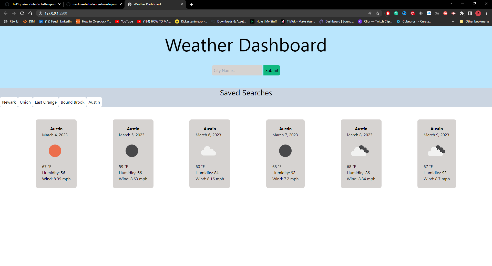
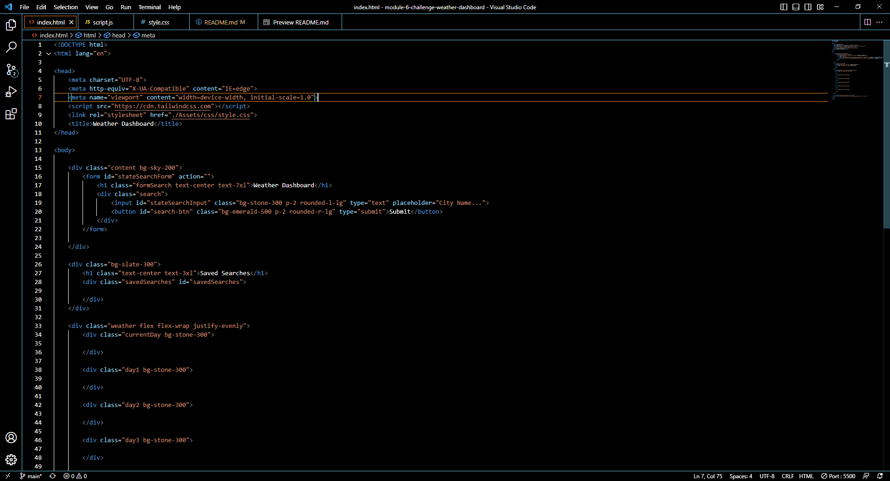
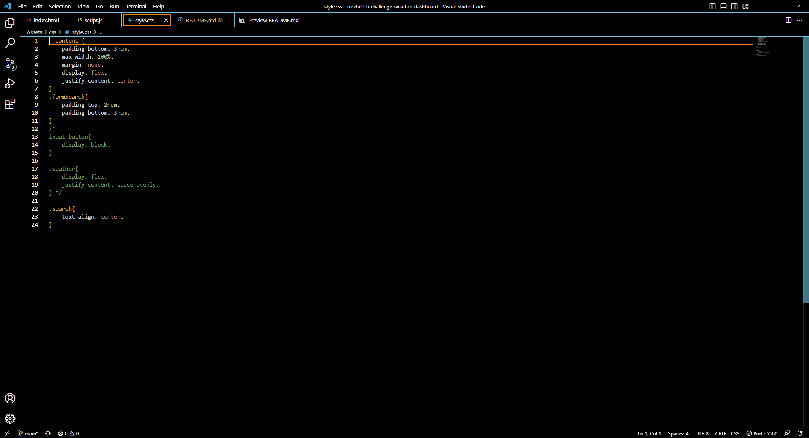
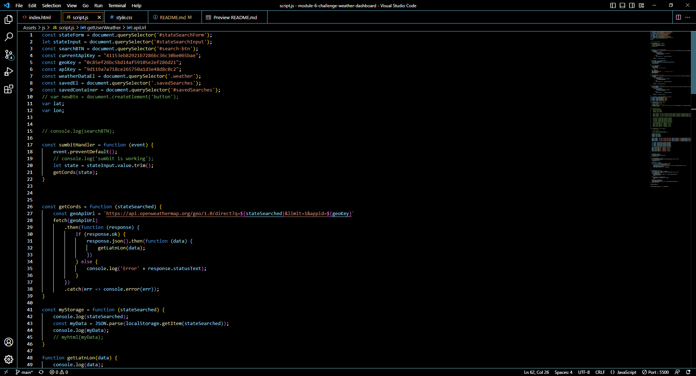

# Module 06 Challenge Weather Dashboard
## -->[Link to the Deployed page](https://thvt1guy.github.io/module-6-challenge-weather-dashboard/)<--

## Coded from scratch
- Enter desired city in the search bar
- Click submit to begin the search
- The saved searches tab will be updated with recently searched city
- A list of days containing the city name, the date, weather icon, temperature, humidity, and wind speed, all in Imperial units
  
## WEBSITE PAGE GIF

## HTML FILE IMAGE

## CSS FILE IMAGE

## JavaScript FILE IMAGE
